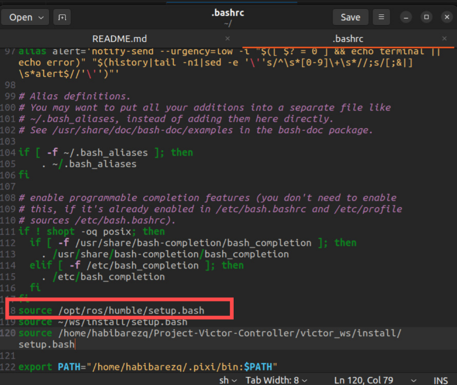
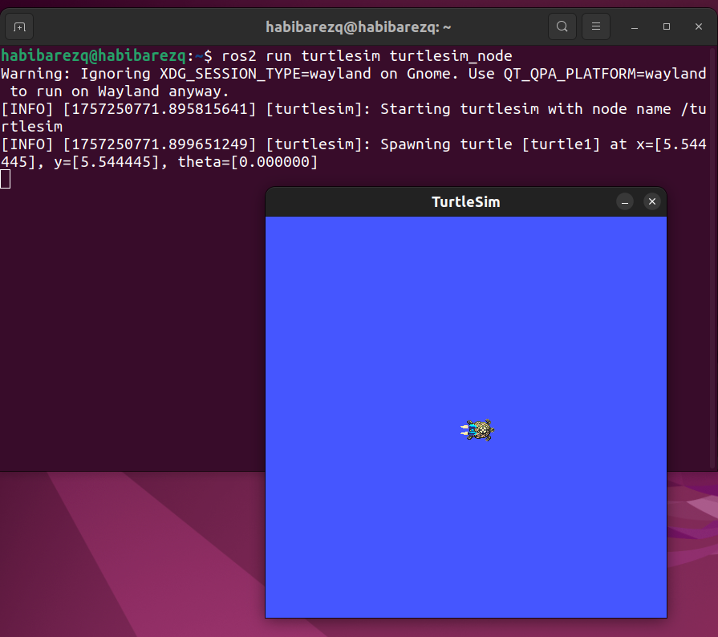

# ROS 2 Python Package Workshop

## Prerequisites (Linux Setup)

### 1. Install Visual Studio Code 
Follow this tutorial: 
https://youtu.be/ChwsFldra-o?si=HwfVwrri5mSo_025
---
### Before creating the workspace, install the required tools.

### 2. Install `colcon`
```bash
sudo apt update
sudo apt install colcon 
```
or if the above didn't work try
```bash
sudo apt install python3-colcon-core
```

### 3. Install `gedit` (text editor)
```bash
sudo apt install gedit -y
```

### 4. Install turtlesim

```bash
sudo apt update
sudo apt install ros-<YOUR-ROS-DISTRO>-turtlesim -y
```

> ⚠️ Replace `<YOUR-ROS-DISTRO>` with your ROS 2 distribution (`foxy`, `galactic`, `jazzy`, etc.). 

> If you're using ros2 kilted then the command would be `sudo apt install ros-kilted-turtlesim -y`
---

## Source ROS 2 automatically in every terminal 
Instead of sourcing ROS 2 each time you open a new terminal, add it to your `~/.bashrc`.

```bash
# Add this at the end of your ~/.bashrc file
source /opt/ros/humble/setup.bash
```

### Don't Forget to save the file before exiting it!!

> ⚠️ Replace `humble` with your ROS 2 distribution (`foxy`, `galactic`, `jazzy`, etc.) if you’re not on Humble.

Then return to the terminal and reload your bash configuration:
```bash
source ~/.bashrc
```
### Test if ROS2 is now working correctly

Open a new terminal session and type in
```bash 
ros2 run turtlesim turtlesim_node 
```



## Now you're ready to start developing ROS2 Projects!!!

