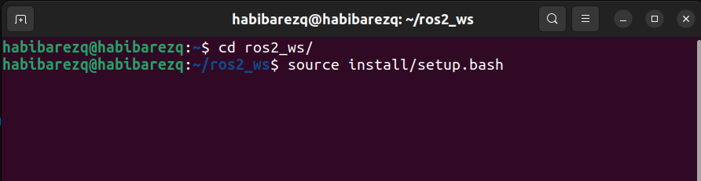
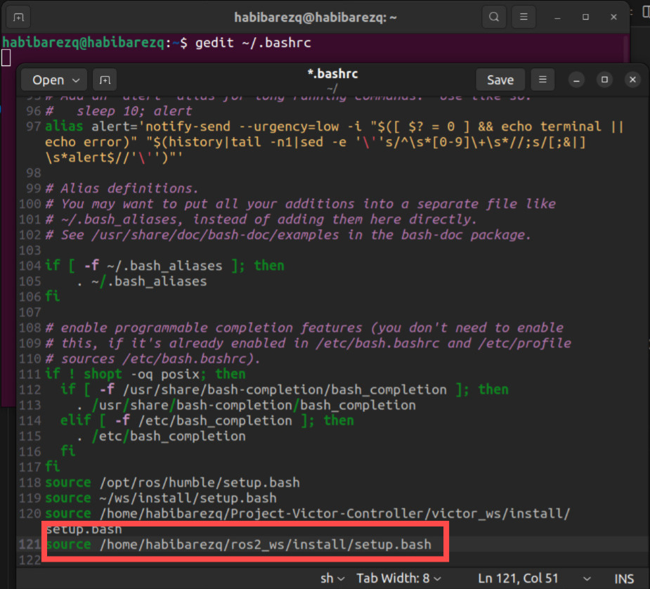

## 1. Create a ROS 2 Workspace

```bash
mkdir -p ~/ros2_ws/src
cd ~/ros2_ws

# Initialize workspace (build once to set it up)
colcon build
```
## 2. Sourcing the workspace

You have 2 options:
 
 ### 2.1 Source your workspace each time you open a new terminal.

Navigate to the location of your workspace ( i have my workspace in the home directory!)



> ⚠️ This must be done each time you start a new terminal !!

### 2.2 Add the source line to the bash file

- Open the bash file using text editor : `gedit ~/.bashrc`

- Go to the end of the bash file and add the source command:

    `source <path-to-ur-workspace>/ros2_ws/install/setup.bash
    `

Then return to the terminal and reload your bash configuration:
```bash
source ~/.bashrc
``` 



## 3. Create a Python Package

```bash
cd ~/ros2_ws/src
ros2 pkg create <package-name> --build-type ament_python --dependencies rclpy my_pkg
```

Folder structure will look like:

```
ros2_ws/
└── src/
    └── my_pkg/
        ├── my_pkg/
        │   ├── __init__.py
        │   └── my_node.py
        ├── package.xml
        ├── setup.py
        ├── setup.cfg
        └── resource/
```

---

## 4. `setup.py` Example

```python
from setuptools import setup

package_name = 'my_pkg'

setup(
    name=package_name,
    version='0.0.0',
    packages=[package_name],
    install_requires=['setuptools'],
    zip_safe=True,
    maintainer='Your Name',
    maintainer_email='you@example.com',
    description='A ROS 2 Python package example',
    license='Apache License 2.0',
    tests_require=['pytest'],
    entry_points={
        'console_scripts': [
            'talker = my_pkg.publisher_node:main',
            'listener = my_pkg.subscriber_node:main',
        ],
    },
)
```

---

## 5. Example Publisher Node (`publisher_node.py`)

```python
#!/usr/bin/env python3

import rclpy
from rclpy.node import Node
from std_msgs.msg import String

class MinimalPublisher(Node):
    def __init__(self):
        super().__init__('minimal_publisher')
        self.publisher_ = self.create_publisher(String, 'topic', 10)
        self.timer = self.create_timer(1.0, self.timer_callback)
        self.count = 0

    def timer_callback(self):
        msg = String()
        msg.data = f'Hello ROS 2: {self.count}'
        self.publisher_.publish(msg)
        self.get_logger().info(f'Publishing: "{msg.data}"')
        self.count += 1
        
def main():
    rclpy.init()
    node = MinimalPublisher()
    rclpy.spin(node)
    node.destroy_node()
    rclpy.shutdown()
```

---

## 6. Example Subscriber Node (`subscriber_node.py`)

```python
#!/usr/bin/env python3

import rclpy
from rclpy.node import Node
from std_msgs.msg import String

class MinimalSubscriber(Node):
    def __init__(self):
        super().__init__('minimal_subscriber')
        self.subscription = self.create_subscription(
            String,
            'topic',
            self.listener_callback,
            10)

    def listener_callback(self, msg):
        self.get_logger().info(f'I heard: "{msg.data}"')

def main():
    rclpy.init()
    node = MinimalSubscriber()
    rclpy.spin(node)
    node.destroy_node()
    rclpy.shutdown()
```

---

## 7. Build and Source the Workspace

```bash
cd ~/ros2_ws
colcon build
```

Since we already added sourcing to `~/.bashrc`, you don’t need to run `source install/setup.bash` every time.  

---

## 8. Run Nodes

```bash
# Terminal 1: Run Publisher
ros2 run my_pkg talker

# Terminal 2: Run Subscriber
ros2 run my_pkg listener
```

---

## 9. Useful ROS 2 Commands

```bash
# List all packages
ros2 pkg list

# List nodes
ros2 node list

# List topics
ros2 topic list

# Echo messages on a topic
ros2 topic echo /topic

# Check node info
ros2 node info /minimal_publisher
```

---

## 10. Notes

- Always **source the workspace** before running nodes (already automated via `.bashrc`).  
- Use `chmod +x filename.py` for executable Python scripts if running directly.  
- Make sure your `entry_points` in `setup.py` matches the node filenames and `main()` function names.  
