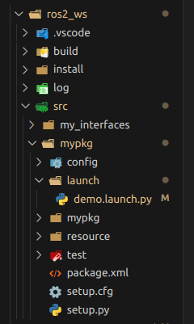

# ROS 2 Launch Files 

Launch files in ROS 2 are used to **start multiple nodes and configure them** from a single file.  
They are especially useful for setting parameters, remapping topics, and organizing large systems.

---

## 1. Basic Launch Command

Run a launch file with: `ros2 launch <pkg_name> <launch_file>` the package name should be where the launch folder is located!! 

```bash
ros2 launch mypkg my_launch.py
```

---
## Folder  Structure : 
### 1. Go to your package, and Create a new Folder called `launch` 
### 2. Inside the folder: create a launch file `demo.launch.py` 


## 2. Launch File Example

**`launch/my_launch.py`**

```python
from launch import LaunchDescription
from launch_ros.actions import Node

def generate_launch_description():
    return LaunchDescription([
        Node(
            package='turtlesim',
            executable='turtlesim_node',
            name='sim'
        )
    ])
```

This starts a single `turtlesim_node`.

---
### YOU HAVE TO CONFIGURE `setup.py` FILE
To enable colcon to locate and utilize our launch files, we need to inform Python’s setup tools of their presence. To achieve this, open the setup.py file, add :
1. TWO IMPORTS :
```python
import os
from glob import glob
```
2. IN THE `data_files` : 
add this line 

```python
(os.path.join('share', package_name, 'launch'), glob('launch/*'))
```

### `setup.py` File Should look like:
```bash
import os
from glob import glob
# Other imports ...

package_name = 'py_launch_example'

setup(
    # Other parameters ...
    data_files=[
        # ... Other data files
        # Include all launch files.
        (os.path.join('share', package_name, 'launch'), glob('launch/*'))
    ]
)
```

## 3. Launching Multiple Nodes
 > DONT FORGET TO Add the Node to the ld object ` ld.add_action(demo_node) ` OR Else your node won't start when you launch the launch file!!!
```python
from launch import LaunchDescription
from launch_ros.actions import Node

def generate_launch_description():
    ld=LaunchDescription()
    
    demo_node=Node(
            package='turtlesim',
            executable='turtlesim_node',
            name='sim'
        )
    
    ld.add_action(demo_node)
    return ld
```

---

## 4. Setting Parameters in Launch Files

## You can pass parameters directly:

```python
from launch import LaunchDescription
from launch_ros.actions import Node

def generate_launch_description():
    return LaunchDescription([
        Node(
            package='mypkg',
            executable='param_node',
            name='param_node',
            parameters=[{
                'robot_name': 'victor',
                'robot_speed': 2.0,
                'manual_mode': False
            }]
        )
    ])
```

## Or load from a YAML file:

### TWO IMPORTS ARE ADDED!!
 1. `from ament_index_python.packages import get_package_share_directory`
 2. `import os`

 ### Inside the `def generate_launch_description():` function
  1. ` config = os.path.join(
    get_package_share_directory('mypkg'),
    'config',
    'params.yaml'
  ) ` 

  2.  YOU SHOULD REPLACE 'mypkg' with your package name where the config folder is created!!

  3. 'config' is the name of the folder where your YAML (parameters file) is located

  4. 'params.yaml'  is the name of the Parameters FIle


### `demo.launch.py` File :

```python
from launch import LaunchDescription
from launch_ros.actions import Node
from ament_index_python.packages import get_package_share_directory
import os

def generate_launch_description():
    config = os.path.join(
        get_package_share_directory('mypkg'),
        'config',
        'params.yaml'
    )

    ld = LaunchDescription()

    param_node = Node(
        package='mypkg',
        executable='param_node',
        name='param_node',
        parameters=[config]
    )

    ld.add_action(param_node)

    return ld

```

---

## 5. Remapping Topics

Like You can change the name of the node using the `name="new_node_name"`

> !! You can also change topic names in a launch file: using `remappings`

`remappings=[('original topic name', 'new topc name')] `

```python
Node(
    package='turtlesim',
    executable='turtlesim_node',
    name='sim',
    remappings=[('/turtle1/cmd_vel', '/my_cmd_vel')]
)
```
## Before : Notice the node name running `turtlesim` and the topic name is `turtle1/cmd_vel`


## After : Notice the node name running `sim` and the topic name is `/my_cmd_vel`

