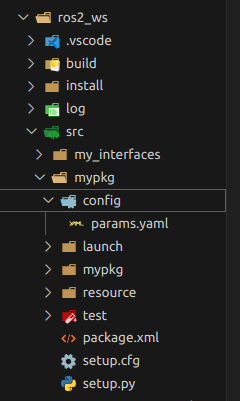

# ROS 2 Parameters
A parameter is a configuration value of a node. You can think of parameters as node settings. A node can store parameters as integers, floats, booleans, strings, and lists. In ROS 2, They are key-value pairs associated with a node and can be declared in code or loaded from YAML files.

---


## 1. Parameter Commands

ROS 2 provides several `ros2 param` CLI commands:

### `ros2 param list`
Shows all available parameters for a running node.
```bash
ros2 param list
```

### `ros2 param get`
Get the current value of a parameter. `ros2 param get <node_name> <parameter_name> `

```bash
ros2 param get /param_node robot_name
```

### `ros2 param set`
Set (update) a parameter at runtime. `ros2 param set <node_name> <parameter_name> <value> `
```bash
ros2 param set /param_node robot_speed 2.5
```

> NOTE: Setting parameters with the set command will only change them in your current session, not permanently. However, you can save your settings and reload them the next time you start a node.

### `ros2 param dump`
Save all parameters of a node into a YAML file. `ros2 param dump <node_name> `
```bash
ros2 param dump /param_node
```

### `ros2 param load`
Load parameters from a YAML file into a running node. `ros2 param load <node_name> <parameter_file> `
```bash
ros2 param load /param_node config/params.yaml
```

---

## 2. Loading Parameters on Node Startup (IF YOU HAVE AN EXISTING YAML file)

You can provide a parameter file when starting a node:

```bash
ros2 run mypkg param_node --ros-args --params-file src/mypkg/config/params.yaml
```

Example `params.yaml`:
```yaml
param_node:
  ros__parameters:
    robot_name: "victor"
    robot_speed: 1.0
    manual_mode: true
```

---

## 3. Declaring and Using Parameters in Code

In Python, declare parameters in your node and access their values:

```python
import rclpy
from rclpy.node import Node

class ParamNode(Node):
    def __init__(self):
        super().__init__('param_node')

        # Declare parameters with default values
        self.declare_parameter('robot_name', 'default_bot')
        self.declare_parameter('robot_speed', 1.0)
        self.declare_parameter('manual_mode', True)

        # Retrieve parameter values directly as Python types
        robot_name = self.get_parameter('robot_name').value
        robot_speed = self.get_parameter('robot_speed').value
        manual_mode = self.get_parameter('manual_mode').value

        self.get_logger().info(f"Robot name: {robot_name}")
        self.get_logger().info(f"Speed: {robot_speed}")
        self.get_logger().info(f"Manual mode: {manual_mode}")

def main(args=None):
    rclpy.init(args=args)
    node = ParamNode()
    rclpy.spin(node)
    rclpy.shutdown()

if __name__ == '__main__':
    main()
```

---
## 4. Using a YAML File
1. Navigate to your package
2. Create a `config` folder 
3. inside your `config` folder create your parameters file `params.yaml`




### Example: `params.yaml`

```yaml
param_node:
  ros__parameters:
    robot_name: "victor"
    robot_speed: 1.0
    manual_mode: true
```

---

## 5. Running with Parameters

Load parameters from a YAML file:

```bash
ros2 run mypkg param_node --ros-args --params-file src/mypkg/config/params.yaml
```

---

## 6. Checking Parameters at Runtime

List parameters of a node:

```bash
ros2 param list
```

Get a parameter value:

```bash
ros2 param get /param_node robot_name
```

Dump all parameters to a YAML file:

```bash
ros2 param dump /param_node
```
